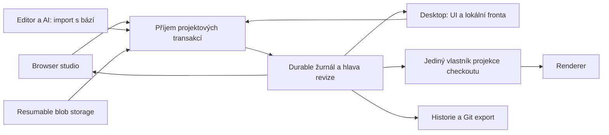

# Audit synchronizace hub ↔ desktop

**13. září 2026 · stav: audit a doporučení, bez schválení implementace či rolloutů**

Auditovaný zdroj: `d50954df2a435f7bbd45598395855305b2b0328f`; nejnovější sync oprava `01bdcfdc` z 11. září. Živá prostředí: AWS `design.studyfi.com` a Cloudflare `alligators.cloud.maude.sh`. Produkční konfigurace ani data nebyly změněny.

## Závěr

Současný systém má užitečný základ pro přenos souborů a obnovu spojení, ale zatím nesplňuje kontrakt spolehlivého designového multiplayeru. Hlavní problém není samotný WebSocket nebo chybějící retry. **Změna uživatele nemá jednu společnou hranici přijetí, zachovaný základ, jednotné ověření a jednoznačný význam „uloženo“.** Soubory, Yjs dokumenty a hubový checkout se navzájem přepisují; každý z těchto mechanismů řeší jen část správnosti.

Na aktuálním zdroji jsem reprodukoval ztrátu nesouvisející vzdálené úpravy při lokálním save, zápis a commit neplatného TSX hubem a souhrn „synced“ při zablokovaném přenosu i konfliktu zdroje. Tyto výsledky platí i po opravách z 11. září. Současně je zásadní rozdíl mezi nasazeními: StudyFi běží na 1.0.9 bez nakonfigurovaného shared-doc loopbacku, Cloudflare na 1.2.0 s tímto rolloutem omezeným na Alligators.

**Doporučuji evoluční změnu kontraktu: jeden logicky autoritativní příjemce projektových transakcí, trvalý žurnál přijatých akcí a odvozené pracovní kopie.** Zachovat lokální práci, existující TSX a dobré části file plane. Strukturované designové operace zavádět postupně tam, kde lze zachovat jejich význam. Nevynucovat převod libovolného TSX na scénový dokument a neslibovat bezkonfliktní slučování libovolných programů.

## Rozsah a síla důkazů

- Historie: znalostní graf včetně úplných RCA, archivované DDR a plány, předchozí jedenáctiagentový sync redesign, kontrola implementace přes Git historii.
- Zdroj: studio sync/projection, file ledger/journal, hub workspace agent, cell lifecycle, role a trust gates, status UI, historie a undo.
- Reprodukce: skutečné produkční moduly v dočasných adresářích; [skript](reproduce.ts), [naměřený výstup](reproduction-results.jsonl).
- Existující cílené testy: **162 prošlo, 0 selhalo, 652 assertions**, šest souborů. Testy source safety, shared projection/convergence, seed duplication/progress a file membership nepokrývají všechny nově nalezené scénáře.
- Živá infrastruktura: health endpointy, Cloudflare deployment a vybrané živé bindings, AWS Docker konfigurace, resource snapshot a CloudWatch. Pouze čtení; přes SSM byly spuštěny diagnostické příkazy.
- Neprovedeno: úplný onboarding dvou nových designérů v GUI, reálný 8,8GB seed, produkční load test, výpadek kontejneru/disku a restore drill. Níže tyto garance nenazývám ověřenými.

Detailní podklady a další odkazy jsou v [evidence.md](evidence.md). Po auditu proběhla [nezávislá debata tří perspektiv](debate.md).

## Co jsme již zkusili a proč to ještě nestačí

| Etapa | Přínos | Co nezmizelo |
|---|---|---|
| [DDR-064](../../../.ai/archive/decisions/DDR-064-single-shared-collab-doc.md): jeden sdílený doc | Omezení driftu mezi dvěma lokálními Y.Doc | Další autoři diskových souborů a přepis celého textu |
| DDR-110 a DDR-120: live overlay, distribuce, soft presence | Přítomnost a koordinace lidí | Presence není vynucená serializace; tvrzení o nemožnosti online konfliktů bylo příliš silné |
| [Předchozí sync redesign](../../../.ai/plans/notes/sync-redesign-dossier/), DDR-226 | Žurnál, CAS, ledger, tombstones a jednotnější file plane místo sedmi cest | TSX zůstal opaque Y.Text; file delivery není doménová transakce |
| DDR-227: důkladně posouzený Git transport | Správně pojmenované limity packů, binárních dat, trust filtrů a chybějících live událostí | Přesun přenosu na Git by nevyřešil multiplayer ani osobní undo |
| DDR-228: repo-owned/hub-owned, plný lokální mirror | Zachovaná lokální a offline práce | Připojení složky a seed zůstaly součástí běžného pracovního toku |
| [Velký seed, září](../../../.ai/plans/archive/feature-large-project-seed-and-sync-progress.md) | Credential cache/singleflight, backoff, Retry-After, progress a startup ochrany | Reálné dokončení velkého seedu a dvoustrojový drill nebyly při uzavření prokázány |
| RCA #121 a `01bdcfdc`, 11. září | Multi-hunk diff, oprava legacy seedu, syntax kontrola a recovery kopie | Ztráta záměru u stale whole-file importu a odlišná validační cesta hubu |

Nejde tedy o systém bez předchozího promýšlení nebo bez testů. Opakovaně se opravovala skutečná selhání. Hranice minulého redesignu však výslovně ponechala nejsložitější otázku — význam souběžných změn zdroje — otevřenou. Další patch přenosu tuto hranici neposune.

## Jak současný systém funguje

Jedno multiplexované WebSocket spojení obsluhuje dokumenty canvasů; nejde o samostatný socket pro každý canvas. Yjs obsahuje text TSX/CSS a další sdílená data. Současně existuje souborová rovina s žurnálem, pořadím změn, hash preconditions, lokálním ledgerem a periodickou reconciliací. Ta má rozumné mechanismy pro zmeškané události, smazání a opakované přenosy.

Slabé místo je spojení obou rovin. Řada vizuálních editací vede přes HTTP přepis zdroje na disk, watcher, import do Yjs, další projekci a reload. Externí editor také ukládá celý soubor. Projekce Yjs → disk má debounce 800 ms. Hub workspace agent přitom promítá dokumenty do stejného checkoutu jako cell studio a vytváří Git commity. Disk tedy není pouze jednoznačně odvozená kopie a lokální save nemusí nést informaci, z jaké revize vznikl.

Existuje historie i undo: automatický Git commit po 3 sekundách klidu, nejpozději po 15 sekundách dávky; per-canvas command stack s 50 akcemi a sessionStorage; samostatné photo/timeline stacky. **Chybí společný význam logické akce a bezpečné chování jejího undo po zásahu kolegy.**

## Nálezy seřazené podle dopadu

### 1. P0 — platný lokální save může odstranit platnou změnu kolegy

Reprodukce na aktuálním kódu:

```text
Společný základ:   title="old", color="black"
Vzdálený uživatel: title="new", color="black"
Lokální editor:   title="old", color="red"    (vychází ze starého základu)
Skutečný výsledek: title="old", color="red"
Očekávaný výsledek nezávislých změn: title="new", color="red"
```

Vzdálená změna už dorazila do dokumentu, ale ještě se nepromítla na disk. Import místního souboru počítá rozdíl proti aktuálnímu dokumentu, a přeloží tak zastaralé `title="old"` jako nový uživatelův záměr. Syntax kontrola nepomůže: všechny tři vstupy i výsledek jsou validní.

`projection.ts` vytvoří recovery kopie a oznámí konflikt, následně však zavolá recovered; zapojení v `sync/index.ts:2920` tím konflikt vymaže. Kopie nejsou totéž jako vyřešené slučování. Toto je prokázaný mechanismus ztráty editace, nikoli důkaz příčiny konkrétního uživatelova incidentu.

**Nutná změna:** zachovat přesný základ importu, odlišit lokální rozdíl od peer změn a nepřijmout nejednoznačný import tichým přepsáním. U neinstrumentovaného externího editoru nelze vždy poznat skutečný základ jeho rozpracovaného bufferu; tehdy je bezpečná cesta uchovat kandidáta a vyžádat skutečné vyřešení, ne si záměr domyslet.

### 2. P0 — hub obchází ochranu před neplatným TSX

Reálný `createWorkspaceAgent` v dočasném Git repozitáři přijal nejprve platný canvas a poté syntakticky neplatný zdroj. Přepsal dobrý soubor a `flush()` úspěšně vytvořil commit vadné verze. Cesta `apps/hub/src/workspace-agent.mjs:590–635` přes `workspace-files.mjs` nesdílí syntax gate desktopové projekce.

To vysvětluje, proč oprava jednoho projectoru nemůže dát systémovou garanci. Nelze z toho bez incidentních dat určit původ každého rozbitého lokálního TSX. Lze však prokázat, že vadná verze má stále otevřenou cestu do sdíleného checkoutu a historie.

**Nutná změna:** jedna přijímací a validační hranice pro všechny autory. Vadný nebo neúplný kód může zůstat pracovním kandidátem, zatímco ostatní vidí poslední přijatou verzi. Parser je minimum; nezaručuje správné importy, runtime chování ani význam programu.

### 3. P0 — „synced“ není spolehlivý souhrn

`syncPresentation` při 91 synchronizovaných dokumentech, jednom selhaném souboru, blocked file progress a konfliktu zdroje vrací `phase=synced` a „Synced … all 91 canvases“. Tuto funkci používají statusbar a CloudBar. Samostatný progress panel již existuje; různé části UI však podávají protichůdné informace.

**Nutná změna:** jedno odvozené projektové shrnutí, které zahrne nepřijaté akce, konflikty i potřebná média. Rozlišit spojení, přijetí změny, její trvalé uložení a doručení připojeným klientům. „Uloženo“ nesmí znamenat pouze otevřený socket nebo shodný počet dokumentů.

### 4. P1 — velká média mohou být odmítnuta i zcela vynechána

Současný upload door má limit 95 MiB. Lokální scanner navíc přeskočí soubor nad 512 MiB ještě před jeho zařazením do ledgeru (`file-plane.ts:444`). Reprodukce s řídkým 513MiB MP4 potvrzuje, že ve výsledném seznamu není, zatímco malý SVG ano. Nešlo o skutečný upload.

U Alligators historický problém zahrnoval 8,8 GB vstupních dat, 2961 položek ledgeru a 803 nedoručených položek o přibližně 2305,9 MB. Dva soubory měly 164,9 a 465,8 MB, tedy nad upload limitem. Celková velikost adresáře není totožná s přenášenou sadou — runtime soubory se záměrně vyřazují.

Credential mint na každý request, chybné 502 a retry zesílení byly skutečný bottleneck a mají implementované opravy. Nelze ale tvrdit „vyřešeno“, dokud není prokázán celý seed a shoda dvou klientů. Současné health to nedokazuje.

**Nutná změna:** úplný inventář s explicitním důvodem vyloučení nebo blokace každého uživatelského souboru; resumable multipart přenos; hash verifikace; dokumenty a aktivní média mají prioritu. R2 multipart podporuje — 95 MiB je limit Maude cesty, nikoli obecný limit R2. [Cloudflare dokumentace](https://developers.cloudflare.com/r2/objects/upload-objects/)

### 5. P1 — osobní undo může přepsat novější práci kolegy

CSS undo command obsahuje předchozí i očekávanou aktuální hodnotu (`from`), ale bridge v `app.jsx:12668–12680` ji pro CSS/attr nepředá a příslušný API handler ji nevyžaduje. Undo tak může bez podmínky nastavit starou hodnotu přes novější peer změnu. Ověřen byl command payload a zdroj přijímací cesty, nikoli dvouuživatelská GUI relace.

**Nutná změna:** undo jako nová kompenzační transakce vlastní akce. Při nezměněné dotčené vlastnosti se provede; při zásahu kolegy zachová jeho práci a oznámí přeskočenou nebo nejednoznačnou část. Obnovení starší projektové revize je jiná akce a vytváří novou revizi. Časový Git batch není ani jedna z těchto věcí.

### 6. P1 — cloudová trvanlivost a dostupnost jsou spojené s render kontejnerem

Yjs ukládá Hocuspocus do SQLite. File journal tail se zapisuje do R2 s debounce 2 s; tento tail ale sám neobsahuje změny Yjs body. Celkové generation backupy mají default 6 hodin u samostatného hubu a cloudový override 10 minut. Uložení do SQLite uvnitř ephemeral prostředí proto samo nedokazuje, že potvrzená editace přežije ztrátu disku kontejneru. Riziko plyne z kódu; skutečný výpadek nebyl vyvolán.

Cloudový startup čeká na port až po obnově checkoutu, s timeoutem 30 minut. Dostupnost dokumentu je tak spojena s obnovou pracovních dat a startem studia.

**Nutná změna:** definovat failure model a potvrzovat přijatou revizi až po durable commit do odpovídajícího úložiště mimo nahraditelný renderer. Autorizace a načtení dokumentu mají fungovat bez obnovy všech médií. Snapshot zrychluje start; nenahrazuje žurnál přijatých akcí.

### 7. P1 — onboarding a role neodpovídají „vyber projekt a pracuj“

Desktop dnes významně pracuje s připojením otevřené složky, adopcí a ochranami proti nesprávnému projektu. Tyto ochrany mají smysl, ale běžný designér nemá rozhodovat o vlastnictví mirroru a transportu. Designer role také musí mít úplnou sadu oprávnění pro běžnou práci; code modules mají samostatný owner-only write gate a lokální příjem samostatný trust souhlas.

**Nutná změna:** účet → dostupné projekty → spravovaná lokální kopie vytvořená aplikací → otevřený canvas. Existující složku připojovat jako pokročilý pracovní tok. Oddělit distribuovatelný projektový manifest od lokálních trust anchors; nepřenášet celý `config.json` jen pro pohodlí. Sjednotit produktová oprávnění bez odstranění ochrany před nedůvěryhodným kódem.

## Co ukázala živá infrastruktura

| | AWS StudyFi | Cloudflare Alligators |
|---|---|---|
| Běžící verze hubu | 1.0.9 | 1.2.0 |
| Nové opravy z 11. září | Nejsou součástí této verze | Nejsou součástí této verze |
| Identita dle health | `off`, token auth | `hybrid` |
| Shared-doc loopback | `MAUDE_CELL_PAIRING` unset; entrypoint jej nenastavuje | Živý Worker binding `CELL_LIVE_PAIRING=alligators`; pilot, ne celá flotila |
| Aktuální liveness | Studio ready, 104 canvasů | Studio ready, 91 canvasů |
| Uložení / obnova | Docker volumes pro `/repo` a `/data`; default 6h backup | Ephemeral cell, object storage, 10min backup override |
| Co health neprokazuje | Shodu všech souborů, role onboarding, úspěšný restore | Dokončený seed, shodu klientů, přežití posledních editací při ztrátě disku |

StudyFi běží na sdíleném `t3.large` hostu společně s dalšími službami. Hub nemá vlastní CPU/RAM limity. Jednorázové měření ukázalo 48 % využití disku, přibližně 5,9 GB dostupné RAM a hub kolem 238 MiB / 0,25 % CPU: **aktuální saturaci jsem neprokázal**. Health hlásil 13 neúspěchů při obnově assetů; bez seznamu objektů a kontroly současného stavu to není důkaz 13 aktuálně chybějících obrázků. Poslední vzorek logů obsahoval úspěšné pravidelné zálohy; restore nebyl otestován.

Cloudflare active deployment pochází ze 4. září. Konfigurace maude-cells používá standard-1 (0,5 vCPU, 4 GiB RAM, 8 GB disk), `max_instances=5`; API hlásilo pět živých instancí. Nejde o důkaz vytížení ani počet zákazníků. Osm GB není maximum platformy, větší typy existují. Pro velký projekt je nutné změřit skutečný přenášený working set včetně dočasných kopií a obnovy; porovnat hrubých 8,8 GB s diskem nestačí. [Cloudflare limity](https://developers.cloudflare.com/containers/platform/limits/)

**Praktický závěr:** nasazení aktuální verze je nezbytné pro získání již hotových oprav, ale samo neodstraní nově reprodukované chyby. Obě distribuce musí procházet stejným produktovým conformance testem. Samotné AWS vs. Cloudflare není příčinou rozdílné kvality multiplayeru; liší se i verze a zapnuté cesty.

## Jak bych systém navrhl

### Jedna autorita přijaté revize, více rovnocenných klientů



„Jedna autorita“ je logická, ne požadavek na jeden globální proces: projekty mohou mít oddělené koordinátory. AWS a Cloudflare mohou mít jiné adaptéry persistence, ale stejný protokol, pořadí přijetí, role a pozorovatelné chování. Konkrétní databázi a koordinátor bych vybral až po durability prototypu.

Každá navržená akce nese projekt, actor/device, session/origin, stabilní transaction ID, základní revizi, hranici akce a potřebné preconditions. Retry stejného ID nevytvoří druhou akci. Server validuje oprávnění, slučitelnost a referencované objekty; uloží payloady a atomicky přijme metadata revize. **Teprve potom vrací durable ACK.** Pořadí live publikace a označení „uloženo“ musí tento rozdíl respektovat.

Před commit metadat mohou zůstat nepoužité blob objekty k pozdějšímu GC. Po commit musí být revize rekonstruovatelná. Multi-file akce se pro renderer zveřejní jedním revision manifestem. Obyčejný filesystem nedává externím editorům atomický snapshot více souborů přes několik rename — tuto hranici nelze schovat marketingovým tvrzením.

### Dvě podoby autorství bez ztráty TSX

1. **Strukturované designové akce:** stabilní element ID, vlastnost, vložení, přesun, smazání. Souběžná změna barvy a textu zůstane dvěma nezávislými úmysly. Drag je jedna finální historie akce; průběžné preview je dočasný kanál. Politika souběhu stejné vlastnosti musí být výslovná a dohledatelná.
2. **Kód a externí soubory:** zachovat zdroj beze ztrát. Editační relace posílá operace nebo diff vůči známé bázi. Nejednoznačný whole-file import zůstane uchovaný kandidát; nepoškodí publikovaný render. AI má explicitní begin/commit hranici pro více souborů. Klid watcheru je pouze heuristika importu, nikoli důkaz jedné logické akce.

Není realistické garantovat univerzální bezeztrátový obousměrný převod libovolného TSX do scénového grafu. Nativní strukturovaný model proto zavést na podporované podmnožině a prokázat round-trip. Nezávislé code islands zůstanou plnohodnotně zachované; jejich konflikty se řeší jako konflikty kódu.

Figma historicky popsala multiplayer nad dokumenty s granularitou vlastností. Zároveň v roce 2025 popsala vlastní současné editace kódu pomocí serverového slučování operací a Eg-walker. Benchmark tedy není „Figma kód neřeší“, ale **jasná reprezentace editace a pravidla jejího přijetí**. Ani výměna Yjs za jiný CRDT sama nevyřeší syntaxi nebo ztracený základ importu. [Figma multiplayer](https://www.figma.com/blog/how-figmas-multiplayer-technology-works/), [Figma code layers](https://www.figma.com/blog/building-figmas-code-layers/)

### Historie a undo jako součást akcí

Historie bude přijatý žurnál se jménem autora a srozumitelným popisem, například „Změnila rozložení úvodní stránky“. Git zůstane odvozenou historií/exportem pro zdroj, nikoli hranicí multiplayerové konzistence.

Undo cílí na moje akce v dané session; musí znát původ a ověřit, že kompenzace nesmaže navazující práci kolegy. Redo je další validovaná akce, nikoli slepé opakování starého patch. Skupiny undo musí vycházet z drag/AI transakce, ne pouze z časového okna. Yjs nabízí `trackedOrigins` a seskupování v UndoManager, ale vhodnost pro celý tento kontrakt se musí ověřit. [Yjs dokumentace](https://docs.yjs.dev/api/undo-manager)

### Projekt se otevře před stažením všech médií

Metadata a aktivní dokumenty mají vlastní dostupnost nezávislou na rendereru a plném restore. Klient stáhne nejprve pracovní sadu, média podle potřeby; kompletní offline kopii může dokončit na pozadí nebo na výslovný požadavek. Lokální soubory i offline změny zůstanou zachovány.

Přijatá akce nesmí odkazovat na nepřipravený blob bez definovaného pending stavu. Upload nejprve zajistí durable objekt, potom se přijme reference; případné optimistické lokální preview se tak také označí. Multipart pokračuje po přerušení, ověřuje hash a nevytváří při retry nový seed.

## UX, které má designér skutečně vidět

| Situace | Očekávané chování |
|---|---|
| Pozvání do projektu | Přijetí pozvánky, přihlášení, projekt ve výběru; žádný token, port, Git ani volba transportu |
| První otevření | Otevře se canvas; aplikace sama spravuje lokální umístění a dotahuje média |
| Běžná editace | Okamžitá lokální odezva, změna se objeví kolegům; žádné tlačítko sync nebo commit |
| Uložení | Krátké „Ukládám…“, pak „Uloženo“ až po durable ACK; ne slib, že offline kolegové již vše viděli |
| Offline | „Pracujete offline, změny jsou uložené v tomto zařízení“; fronta přežije restart |
| Návrat online | Bezpečné přijetí a slučování; nejednoznačné změny zůstanou zachované a viditelně čekají na rozhodnutí |
| Vadný kód | Ostatním zůstane poslední funkční přijatá verze; autor dostane konkrétní problém a obnovitelnou pracovní verzi |
| Undo po zásahu kolegy | Vrátí vlastní nezávislou změnu; upozorní na část, kterou nemůže bezpečně vrátit |
| Velké nebo nepřenosné médium | Soubor a důvod jsou viditelné, upload lze obnovit; žádné tiché vynechání |
| Historie | Logické akce, autor, náhled revize, obnovení jako nová změna |

Cloud a self-host se mohou lišit vstupní adresou a správou organizace. Po přihlášení musí platit tentýž pracovní tok a stejná oprávnění designéra.

## Doporučený postup a podmínky přijetí

Jde o návrh pořadí práce, nikoli nový schválený implementační plán.

### Fáze A — zastavit ztráty a sjednotit pravdivost

- Uzavřít stale import a hubový bypass validační cesty; recovery konflikt nevymazat jen proto, že se uchovala kopie.
- Sjednotit projektový status, úplný inventář a explicitní blokace souborů.
- Připravit společnou verzi a feature konfiguraci pro obě prostředí, ověřit čistý designer onboarding. Nasazení je samostatná navazující práce.
- Přidat regresní scénáře z tohoto auditu a dvouklientské testy; samotných nynějších 162 passing testů není release důkaz.

**Gate:** žádná tichá ztráta nezávislé editace, žádný neplatný kandidát nepřepíše přijatý render, žádné „uloženo“ se známou blokací. Každý vstupní uživatelský soubor je v inventáři nebo má vysvětlené vyloučení.

### Fáze B — prototyp společného přijímání změn a trvanlivosti

- Jediná cesta přijetí transakce, idempotence, revize, durable ACK a jeden vlastník checkout projekce.
- Všechny autory včetně lokálního API, AI a browseru přivést přes tuto cestu. Staré writery odmítat protokolovou verzí/epochou; neponechat funkční obchvat.
- Oddělit načtení projektu od rendereru a bulk restore; blob multipart a konzistentní manifest.
- Ověřit tentýž kontrakt na AWS i Cloudflare, nejdříve pilotem bez produkční migrace.

**Gate:** fault injection před i po každé hranici payload → metadata commit → ACK → broadcast. Nula ztracených potvrzených akcí při restartu procesu a ztrátě nahraditelného kontejnerového disku; opakování požadavku vytvoří jednu revizi. Disaster recovery úložiště má zvlášť definované RPO/RTO — tyto dvě garance se nesmějí zaměnit.

### Fáze C — designové operace, historie a project-first desktop

- Pilot stabilních ID a strukturovaných operací na jasně ohraničené podmnožině; zachovat všechny ostatní zdroje.
- Osobní undo/redo s peer preconditions, historie logických akcí, explicitní AI multi-file transakce.
- Projektový výběr a automatická lokální kopie jako default; pokročilé připojení složky dál dostupné.

**Gate:** dva designéři a AI editují stejný canvas; nezávislé vlastnosti se zachovají, kolize stejné vlastnosti má předvídatelný výsledek a historii. Undo A nezruší novější nezávislou práci B. Návrat offline klienta a obnovení historie nevyžadují ruční opravu TSX.

### Fáze D — migrace a odstranění starých autorit

Migrace potřebuje úplný inventář a konzistentní snapshot, krátkou bariéru zápisů při přepnutí, nový epoch/fencing token a ověřenou shodu exportované projekce. Staré klienty nelze nechat zapisovat do staré autority souběžně s novou. Rollback po nových editacích musí nejprve zachovat/exportovat i tyto editace; návrat ke starému snapshotu by je zahodil.

Odstranit konkurenční hubový projector, watcher jako nezávislou online autoritu, nepoužívané legacy write cesty a interpretaci Git batch jako produktové transakce. Zachovat watcher jako kontrolovaný importní adaptér, souborový ledger, content hashing a Git export tam, kde mají jasnou úlohu.

## Měřitelné ověření místo dalšího „mělo by fungovat“

Následující hodnoty jsou **navržené cíle**, nikoli naměřený výkon:

- Lokální běžná manipulace p95 pod 50 ms; mezi dvěma připojenými klienty ve stejném regionu a při RTT do 100 ms viditelná vlastnost p95 do 300 ms, p99 do 1 s. Měřit od uživatelské akce po render druhého klienta, ne jen server broadcast.
- Warm otevření aktivního dokumentu do 2 s za specifikovaného zařízení a připojení; první interakce nesmí čekat na všechna média. Cold restore má vlastní měření, ne skrytý 30min spinner.
- Přijaté akce: 0 ztracených a 0 duplicit po definovaných pádech; nepřijatá lokální fronta přežije restart aplikace.
- Reálný Alligators inventář včetně velkých médií: dva čisté klienty, obousměrný přenos, přerušení a navázání, výsledná shoda hashů všech zahrnutých souborů. Explicitní evidence vyloučených položek. Žádný závěr jen z počtu canvasů.
- Onboarding designer role na čistém stroji pro oba backendy, odebrání přístupu, reconnect, expirované přihlášení, starší klient a souběžné AI změny.
- Provozní metriky: stáří nejstarší nepotvrzené akce, durable ACK latency, revision lag, rejected/conflicted actions, ledger missing/blocked bytes, resumable upload retries, cold-open čas. Diagnostika koreluje project/revision/transaction ID a nevyžaduje čtení obsahu designu.

Za těchto podmínek lze slibovat jednoduchost, kterou uživatel nemusí hlídat. Bez nich další debounce, retry nebo zelená kontrolka pouze přesunou selhání na jinou cestu.
