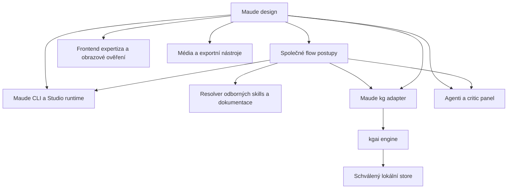

# Maude: audit kompatibility Claude Code a Codex

> **Následná implementace:** zadání bylo zúženo na minimální nativní Markdown distribuci a optimalizaci skills. Viz [provedené změny a ověření](implementation.md) a [instalace](../../native-plugins.md). Tento audit zachycuje původní stav; širší návrhy adaptérů nejsou závazkem této implementace a ACP je odloženo.

**Dual support je proveditelný se zachováním celého katalogu. Současný setup však poskytuje přenos obsahu, nikoli prokázanou paritu workflows.** V izolovaném Codexu 0.154.0 se podařilo nativně nainstalovat oba pluginy a objevit všech **85 skills: 30 původních skills a 55 převedených příkazů**. Stávající bridge neinstaluje **31 agentních rolí**. Největší zbývající práce je v jejich orchestraci a oprávněních, kgai auto-capture, závislostech, argumentech a rozlišení prostředí CLI versus Studio.

Doporučený směr je **jeden společný zdroj postupů, dvě nativní distribuční varianty a malé explicitní adaptéry pro chování harnessu**. Claude Code musí zachovat současné funkce. Codex potřebuje vlastní smlouvu pro načítání, delegování, otázky, hooky a modelové profily. Automatický převod Markdownu sám tuto smlouvu nenahrazuje.

## Rozsah a jistota závěrů

Audit zachycuje stav k **13. září 2026**, Maude **1.2.0**, commit `d50954df2a435f7bbd45598395855305b2b0328f`. Lokálně ověřené verze: Claude Code **2.1.270**, skutečná binárka Codex **0.154.0**, Node **24.13.0**, Bun **1.3.3**, kgai na PATH **1.6.0**. Obsahuje oba pluginy `design` a `flow`, jejich pomocné soubory, harness bridge, CLI, návaznost na Studio a závislosti dostupné v tomto prostředí. Při závěrečné kontrole byly nově přítomné neversionované `AGENTS.md`, `.codex/` a `.agents/`; jejich dodatečný nález je uveden v §4, mimo commitový baseline.

Závěry rozlišují tři druhy důkazů: implementaci a její testy; aktuální oficiální dokumentaci; přímé izolované sondy skutečných CLI. Návrhy níže jsou doporučení k implementaci, nikoli již provedená změna architektury. Neproběhla migrace uživatelské instalace, publikace ani úplné spuštění všech workflows s placenými modely. Přihlášené TUI, vlastní role, mediální exporty a kvalita modelových výstupů proto nemají status end-to-end ověřeno.

Přílohy:

- [Kompletní inventář](inventory.csv): 119 řádků, z toho 116 příkazů, skills a agentních rolí plus tři podpůrné dokumenty v adresářích agentů. Každá položka má cestu, hash, výsledek discovery a indikátory nutné adaptace.
- [Deklarované závislosti](dependencies.csv): všech 24 deklarací, jejich kontrolní příkazy, návaznosti a stávající fallbacky.
- [Důkazy a reprodukce](verification.md): výsledky testů, izolované instalace, kgai sondy a jejich omezení.
- [Strojový souhrn](evidence.json): počty, verze, commit a nalezené syntaktické problémy.

Indikátory v CSV vznikly statickým vyhledáváním. Přítomnost výrazu není sama o sobě chyba a nepřítomnost nezaručuje kompatibilitu; například odkaz na `flow:debate-protocol` přenáší další závislosti tranzitivně.

## 1. Jak moc je Maude kompatibilní právě teď

| Vrstva | Zjištěný stav | Co z toho lze vyvodit |
| --- | --- | --- |
| Instalace nativního Codex pluginu | Ověřena na 0.154.0 pro oba podporované formáty manifestu | Není nutné spouštět Claude Code, aby Codex uměl distribuovat Maude |
| Původní skills | 30/30 objeveno v izolovaném loaderu | Obsah se neztrácí; postupy uvnitř ještě vyžadují adaptaci |
| Claude příkazy jako Codex skills | 55/55 objeveno | Převod entrypointů funguje; argumenty a vnitřní odkazy nejsou automaticky ekvivalentní |
| Vlastní agentní role | 31/31 stávajícím bridgem neinstalováno | Kritické omezení pro critic panel, security review, research a další delegované části |
| Hooky | Maude má tři command handlery SessionStart; kgai přidává další | Načtení hooku, jeho trust a správné chování se musí ověřovat odděleně |
| kgai CLI | `kg search` funguje; `maude kg resolve` hlásí aktivní integraci | Základní práce s grafem je dostupná, auto-capture tím není prokázán |
| Sdílený stav | `.ai/` a `.design/` zůstávají na místě | Vhodný základ pro střídání harnessů bez migrace pracovních dat |
| Studio chat | Implementace používá Claude ACP adapter | Instalace Codex pluginu sama nepřepne chat ve Studiu na OpenAI |
| Úplná funkční parita | Neověřena a současným kódem nesplněna | Není poctivé uvádět jedno procento celkové kompatibility |

**Praktická odpověď na „lze vše používat jako doteď?“ je zatím ne.** Codex umí katalog načíst a použít velkou část společného CLI. Některé postupy ale odkazují na neinstalované agenty nebo spoléhají na chování Claude Code. Úspěšný jednotlivý běh může být výsledkem improvizace modelu, nikoli reprodukovatelné podpory pluginu.

### Co již existuje a má se využít

Maude má dvě různé integrační cesty:

1. **`maude harness`**: explicitní projekce efektivní konfigurace přes společný meziformát, report schopností a spravované soubory. Obsahuje kontrolu vlastnictví, transakce, rollback a omezení verzí.
2. **`maude codex`**: bridge před spuštěním. Čte výběr Claude pluginů, vytváří lokální marketplace mirrors a instaluje je přes nativní Codex plugin CLI. Doplňuje MCP a za určitých podmínek launch-only profil oprávnění.

Tyto cesty nejsou zaměnitelné. Statický lowerer používá capability registry a explicitní trust hooků; runtime bridge kopíruje pluginový strom, generuje command skills a nový manifest. Jeho generovaný manifest automaticky nepřenáší libovolná původní manifestová pole. Například explicitně deklarované vlastní cesty hooků nebo konfiguraci MCP nelze považovat za zachované jen proto, že soubory existují v kopii. Výchozí `hooks/hooks.json` je jiný případ: Codex jej může načíst i bez deklarace v manifestu.[^3]

Podklady: [runtime bridge](../../../cli/lib/harness/codex-runtime.mjs), [Codex lowerer](../../../cli/lib/harness/targets/codex.mjs), [současná matice](../../harness-capability-matrix.md), [popis projekce](../../harness-environment-projection.md).

## 2. Co nyní podporují oba harnessy

### Pluginy a distribuce

OpenAI aktuálně dokumentuje přenositelný kořenový `plugin.json` s Agent Plugins schématem. `.codex-plugin/plugin.json` zůstává podporovaný kompatibilní formát a stále jej vytváří vestavěný plugin creator. Lokální katalog používá `.agents/plugins/marketplace.json`; CLI nabízí `codex plugin marketplace add` a `codex plugin add`. Oba formáty se v tomto auditu skutečně nainstalovaly.[^1]

Claude Code používá `.claude-plugin/plugin.json` a svůj marketplace. Umí příkazy, skills, agenty, hooky a další typy komponent. Jeho manifest se proto nedá bezeztrátově přejmenovat na Codex manifest.[^5]

**Publikace do veřejného OpenAI katalogu je samostatná větev.** Oficiální převod Claude pluginu doporučuje převést commands a agentní postupy na skills; deklarace Claude dependencies se nepřenáší jako funkční dependency resolver. Veřejné MCP submission má další požadavky, například veřejný HTTPS endpoint. To neznamená, že lokální Codex CLI neumí STDIO MCP.[^2][^9]

Pro první vydání Maude proto doporučuji nativní **lokální/Git marketplace pro Codex CLI**, bez závislosti na veřejném submission procesu. Lokální graf kgai ani lokální Studio kvůli tomu nepotřebují veřejný server.

### Skills, příkazy a jejich názvy

Oba harnessy pracují se `SKILL.md`. Codex dokumentuje explicitní výběr přes `$` nebo `/skills` a postupné načítání plného obsahu podle popisu. Podporuje také `agents/openai.yaml`, například pro uživatelský název, invocation policy a MCP dependencies. Tento soubor je metadata skillu, **není to definice subagenta**.[^4]

Claude navíc provádí vlastní substituce `$ARGUMENTS`, pozičních argumentů a některých proměnných cest; `!` shell interpolace představuje další host-specific chování. `allowed-tools` u Claude skillu uděluje oprávnění, zatímco `tools` u Claude agenta filtruje dostupné nástroje. Tyto dva významy se nesmí při převodu směšovat.[^6][^7]

V Maude dnes existují dvě konvence: runtime bridge generuje `source-command-*`, statická projekce má vlastní `command-*` namespace. Native release potřebuje jeden registr stabilních identit a mapování obou konvencí. Doporučený budoucí tvar je například logická identita `flow.command.plan`, Claude entrypoint `/flow:plan`, Codex skill `flow:command-plan` s krátkým zobrazovaným názvem. Staré `source-command-*` entrypointy mají mít migrační alias, ne tiše zmizet.

Generátor musí pracovat s významem argumentů: například název plánu, `--since`, `--force`, `--quick`, `--no-critic` a cílová cesta. Codex varianta má tyto hodnoty číst z explicitní žádosti a validovat je před použitím. Pouhé ponechání `$ARGUMENTS` v textu z něj nedělá naplněnou shell proměnnou.

### Subagenti a delegace

Codex má vlastní subagenty a konfigurovatelné role v TOML pod `.codex/agents/` nebo `~/.codex/agents/`. Dokumentované povinné položky jsou `name`, `description` a `developer_instructions`; roli lze doplnit modelem, reasoning effort a podporovanými konfiguračními poli. Dokumentace popisuje dědění sandboxu a konfigurace. Aktuální lokální Codex může delegovat na základě explicitní žádosti nebo relevantní instrukce projektu či skillu.[^8]

To opravuje příliš široký výrok „Codex nepodporuje agenty“. **Podporuje je; Maude je zatím bezpečně neprojektuje.** Historie kgai obsahuje přijaté rozhodnutí `maude/codex-agent-isolation-boundary`: při dřívější sondě Codexu 0.152.0 dítě dokázalo zavolat Context7 přes očekávané omezení. Kód proto role neinstaluje a své dříve spravované role odstraňuje.

Novější dokumentace o možnosti konfigurovat `mcp_servers` není důkazem, že všechna omezení tool registry již fungují jako Claude `tools:`. Na 0.154.0 je potřeba znovu provést negativní testy. Do té doby se má zachovat současná hranice a výsledek označit jako neověřený, nikoli automaticky odblokovat všech 31 rolí.

Důležitá nuance platí i pro Claude: absence `Write` při povoleném `Bash` sama nevytváří OS sandbox pouze pro čtení. Audit musí porovnávat skutečně vynucené možnosti, ne slovní označení „read-only“ v názvu role.

### TUI a orchestrátor

| Oblast | Claude Code | Codex | Potřebná úprava Maude |
| --- | --- | --- | --- |
| Spuštění workflow | Namespaced slash entrypoint | Explicitní skill mention / výběr skillu | Host-specific help a příklady; jednoznačná identita workflow |
| Plánování | Workflow může využít Claude plan nástroje | `/plan` je režim Codexu | Nesplést přepnutí režimu s tvorbou Maude plánu |
| Otázky | `AskUserQuestion` | Nástroj závislý na klientu/režimu, případně běžný chat | Jedna fronta otázek řízená vedoucím; fallback zachovávající povinné odpovědi |
| Delegace | `Agent`, dříve `Task`, namespaced role | Nativní spawn/follow-up/wait nástroje a custom agents | Překlad role, zadání, oprávnění a očekávaného výsledku |
| Pokračování | Resume session | Resume/fork Codex threadu | Stav workflow musí zůstat v `.ai/`, nesmí záviset pouze na transcriptu |
| Obrazový vstup | Host-specific Read / image input | Image input a dostupné obrazové nástroje | Skutečné otevření screenshotu, nestačí znát cestu k PNG |
| Oprávnění | Claude rules a permission mode | Sandbox, approval policy, exec rules, managed constraints | Samostatná mapa schopností; žádná globální eskalace kvůli chybějícímu adaptéru |

CLI a TUI mají podobné uživatelské operace, jejich význam ale není stejný. Například Codex `/plan` přepíná režim a není ekvivalent `/flow:plan`. Rozhraní pro automatizaci a obnovení se také liší.[^10][^11]

V této konkrétní relaci je synchronní `request_user_input` omezen na Plan mode a existuje asynchronní varianta. Tento detail je pozorování prostředí, nikoli univerzální garance všech Codex klientů. Adaptér proto musí detekovat skutečně dostupné nástroje. Nedostupné UI otázky nesmí změnit „vyžaduje lidské rozhodnutí“ na automatický souhlas, zejména u placeného generování.

### Debaty a týmy

Maude má již užitečnou abstrakci v `flow:debate-protocol`: `reduce` je nezávislý panel a konsolidace hotových závěrů; `relay` dovoluje revizi stanoviska prostřednictvím nativního runtime. Tuto hranici zachovat. Codex verze musí explicitně požadovat role a mít omezený počet souběžných pracovníků, což současné skill instrukce mohou vyjádřit.

Detekce pouze podle `CLAUDE_CODE_EXPERIMENTAL_AGENT_TEAMS` ale není přenositelná. Aktuální Claude dokumentace navíc rozlišuje interaktivní týmy a neinteraktivní/SDK subagenty; původní `TeamCreate`/`TeamDelete` již nejsou aktuální API. Ani zapnutý flag tedy neslibuje relay v každém Claude prostředí.[^12]

Codex-native zprávy mezi agenty mohou být kandidátem pro relay, ale před deklarací parity potřebují samostatnou sondu: kdo může komu poslat zprávu, jak se obnovují vlákna, co se děje při chybě a zda zůstane zachována izolace. Jestliže relay nebude ekvivalentní, zachovat jej v Claude a Codex profil označit jako `reduce`. **Takový profil zachová workflow, ale nesmí se vydávat za úplnou paritu relay varianty.**

## 3. Závislosti: co se musí přenést spolu se skillem

### Skutečný dependency graph



`plugins/*/dependencies.json` je **vlastní formát Maude preflightu**, nikoli manifest závislostí, který oba harnessy automaticky nainstalují. Současné `.claude-plugin/plugin.json` závislosti na jiných pluginech nedeklarují. Přitom design přímo volá například `flow:kgai-backend`, `flow:debate-protocol` a `flow:question-protocol`.

Claude nyní umí skutečné plugin dependencies včetně verzí; cross-marketplace závislosti mají zvláštní pravidla. To lze využít pro Claude distribuci, ale nejde automaticky přenést do Codex submission formátu.[^13][^2]

| Závislost | Současný stav a dopad | Požadavek pro dual support |
| --- | --- | --- |
| `design → flow` | Skrytá závislost v instrukcích; samotné manifesty ji nevyjadřují | Deklarovat nebo zahrnout skutečně sdílené postupy do každého uzavřeného balíčku; zabránit cyklu |
| `maude` CLI | Manifesty označují jako soft, ale mnohé povinné kroky jej přímo volají | Tvrdá závislost konkrétních workflows; odlišit source, npm a desktop instalaci |
| `kg` engine | CLI je dostupné; grafové funkce jsou capability-gated | Kontrolovat skutečnou binárku, verzi, store, trust i požadované verbové schopnosti |
| kgai plugin | Dodává modelové instrukce a lifecycle capture nad CLI | Nativní hook adapter; neplést přítomnost CLI s auto-capture |
| `frontend-design` | `design:new` má specialistu i explicitní fallback | Resolver podle schopnosti a registry klienta; zachovat oznámení fallbacku |
| `terminal-skills` | Volitelný MCP, v této relaci není mezi dostupnými nástroji | Zachovat fallback na instalované skills a primární dokumentaci |
| Context7 a další MCP | Přenositelné rozhraní, nikoli garantované stejné názvy nástrojů | Discovery, kontrola dostupnosti a auth bez převodu tokenů do souborů |
| `agent-browser`, Chromium, Playwright | Browser CLI je dostupné; browser binary je samostatná schopnost | Ověřit render a screenshot, nejen `--version` |
| `agent-device` | CLI je dostupné; native scénáře potřebují další zařízení/SDK | Samostatný gate pro iOS/Android a případný desktop driver |
| `jq`, Node, Bun | Zde dostupné; helpery je používají | Versioned runtime kontrakt; fallback pouze tam, kde je implementovaný |
| `ffmpeg`, `ffprobe`, whisper | Binárky zde nalezeny; modely a plná funkčnost neověřeny | Kontrola konkrétní mediální operace a modelových dat |
| `svg2pptx` | Na PATH v této sondě nenalezen | Přiznat případný PNG-per-slide fallback; neoznačit jej za editovatelný export |
| Gemini / ElevenLabs a další BYOK | Vlastní mediální backend Maude | Zachovat explicitní volbu a consent; oddělit od modelu Codex/Claude |
| Claude ACP | Implementace Studio chatu závisí na Claude adapteru | Samostatný Codex connector, pokud má i Studio chat být dual-harness |

Aktuální preflight vrací u MCP `unknown`, protože obyčejný Node proces nevidí registr nástrojů agenta. Nález `allHardPass: true` proto nemůže být certifikátem použitelnosti workflow. `maude` je také označeno jako soft navzdory CLI-only pravidlu helperů; `flow` a `design` uvádějí rozdílné instalační balíčky pro `agent-browser`. Tyto nesrovnalosti je potřeba opravit při katalogizaci závislostí, ne přenést do nového balíčku.

Doporučený dependency kontrakt má pro každou operaci obsahovat: identitu schopnosti, rozsah verzí, read-only probe, povinnost pro konkrétní workflow, fallback, host-specific instalaci a vlastníka. Stav musí rozlišovat `available`, `missing`, `disabled`, `untrusted`, `unsupported` a `not-tested`. Deklarace v `agents/openai.yaml` pomohou u MCP, ale nenahradí kontrolu CLI, Chromium ani cross-plugin postupů.

### kgai podrobně

Pro tento repozitář `kg config get store` vrací schválený projektový store **`../.kgai-shared`**. Je lokální a patří do osobního grafu. Dual support musí používat tutéž identitu a namespace `maude/...`; není důvod kopírovat data do `.codex/` ani připojovat StudyFi store.

`kg version` skutečně vrací **1.6.0**, ale `maude kg resolve --json` uvádí `engineVersion: v1.5.1`. Čtení implementace ukázalo, že tato hodnota pochází z konfigurace, nikoli z dotazu spuštěné binárce. Resolver navíc rozhoduje auto-aktivaci podle starších signálů, jako existence projektového `.kgai/store` nebo neprázdná konfigurace store. Nový diagnostický kontrakt má oddělit **požadovanou verzi**, **skutečnou verzi** a **efektivní store**. Dnešní úspěšný resolver v tomto checkoutu není důkazem správné detekce čistého nového projektu se sdíleným storem.

Nejdůležitější rozdíl je v lifecycle integraci:

| Část kgai | Auditní závěr |
| --- | --- |
| `search`, `context`, `history` | Modelově nezávislé CLI; čtení grafu lokálně fungovalo |
| `ingest`, `record-log` | Potřebují správný scope a store; v auditu nebyl proveden nový zápis |
| SessionStart prompt | Shell hook je kandidát k zachování; tato relace již capture rules dostala |
| SessionStart instalace | Nezaměňovat za dependency health; instalace, sync a injection mohou mít pořadí/race problémy |
| Stop auto-capture | Stávající parser očekává Claude JSONL a `Edit/Write/MultiEdit/NotebookEdit` |
| Auto-sync | Pro tento osobní store není potřeba remote sync; zachovat lokální konfiguraci |

Izolovaná sonda stejného `auto-capture-stop.sh` prokázala rozdíl: na syntetické Claude události `Edit` hook vrátil `decision: block`; na syntetické Codex události `apply_patch` nevrátil nic. Sonda nevytvářela rozhodnutí v reálném grafu. Jde o důkaz závislosti parseru na formátu, nikoli měření capture rate skutečných uživatelských relací.

Doporučení: zachovat `kgai` jako samostatnou závislost a přidat host-specific event adapter. Pro Codex preferovat stabilní tool/lifecycle události, které vedou malý per-turn záznam o editaci a provedeném capture. Následný Stop hook může připomenout chybějící strukturální rozhodnutí a respektovat loop guard. Změny přes shell a serverové zápisy vyžadují výslovnou cestu; detekce `apply_patch` sama není úplná. Pokud bude dočasně nutný parser transcriptu, musí být verzovaný, testovaný a označený jako křehký: OpenAI jeho formát nepovažuje za stabilní hook API.[^3]

Capture nesmí proměnit každý edit v architektonické rozhodnutí. Zůstávají pravidla kgai: nezapisovat čisté analýzy nebo neimplementovaná doporučení, nesměšovat stores, zachovat namespace a neudělovat trust automaticky.

## 4. Prioritizované nálezy

Priority vyjadřují blokaci cíle dual support, nikoli skóre bezpečnostní zranitelnosti.

### P0 — chybějící agentní kontrakt

Všech 31 skutečných rolí má `tools:`. Bridge je záměrně neprojektuje. Přesto generované příkazy stále obsahují například `Task tool → subagent_type: flow:security-auditor` nebo povinné critic fan-out. Security workflow chce dvě nezávislé perspektivy; design workflow požaduje více kritiků a keepera. Zjednodušit je na jediného všeobecného agenta by porušilo požadavek zachování workflows.

Náprava: nejprve probe izolace na cílové verzi, poté explicitní mapování role → Codex custom agent či jiná prokázaná izolovaná cesta. Role s omezeným přístupem nesmí automaticky dostat všechny rodičovské MCP. Výstup z read-only role může zapsat vedoucí, pokud to je její schválený kontrakt. Je nutné řešit i role, které vytvářejí report, ale nepovolují `Write`.

### P0 — kgai auto-capture není přenositelný zkopírováním

Konkrétní implementace a sonda jsou popsány výše. Bez nativního adaptéru se může ztrácet rozhodovací paměť i při zdánlivě funkčním kgai skillu. To je významnější než změna názvu slash příkazu.

### P0 — nelze prokázat uzavřenost distribuce a závislostí

Design spoléhá na flow postupy a CLI, které jeho manifest nevynucuje. Některé odkazy míří až do `.ai/plans/notes/` nebo archivních rozhodnutí autorského repozitáře. Například `to-rn` odkazuje na implementaci a generátor v `.ai/plans/notes/to-lottie-poc/`. Takové reference nejsou automaticky součástí instalovaného pluginu. Je potřeba rozlišit nepovinný historický zdroj a soubor nezbytný pro provedení workflow.

Náprava: build musí vytvořit uzavřený balíček s potřebnými resources a kontrolovat dosažitelnost všech povinných referencí. CLI zůstane společným veřejným vstupem. Plugin musí znát kompatibilní CLI verzi, ne odhadovat umístění přes `../..`.

### P1 — rozdíl mezi připnutou a instalovanou verzí

`TARGET_COMPATIBILITY.codex.version` je **0.152.0**; zde je **0.154.0**. Statická cesta s předanou zjištěnou verzí novější runtime odmítá. Runtime bridge používá jinou cestu a tento společný version gate nevolá. Úspěšná runtime instalace tudíž neznamená, že je certifikovaná i statická projekce.

Náprava: společná kompatibilitní politika pro release, statický lowerer a launcher, s testovací maticí a diagnostikou skutečné binárky. Nezměnit jen číslo v registry bez behaviorálních sond.

### P1 — přenáší se text, nikoli argumenty a reference

`renderCommandSkill` ponechává tělo příkazu a přidává pouze wrapper. Nepřekládá `Task`, `AskUserQuestion`, `$ARGUMENTS`, interní slash odkazy ani relativní cesty. Konkrétně `to-lottie` obsahuje `../agents/_draw-motion-rules.md`: z `commands/` je tento odkaz platný, z `skills/source-command-to-lottie/` vede jinam.

Náprava: deterministický build s mapou entrypointů, základní cestou resources a explicitním vstupním kontraktem. Neprovádět plošný search-and-replace `Claude → Codex`; některé zmínky popisují oprávněně konkrétní backend.

### P1 — konfigurace instrukcí není sdílená automaticky

V počátečním snapshotu checkoutu nebyl `AGENTS.md` ani `.codex/config.toml`; v kontrolovaných uživatelských Codex nastaveních nebyl `project_doc_fallback_filenames`. Standardní discovery za tohoto stavu samo neslibuje načtení zdejšího `CLAUDE.md`; případná injekce konkrétním klientem je jiný mechanismus.[^14]

**Dodatečný nález během závěrečné kontroly:** v pracovním stromu přibyly neversionované `AGENTS.md`, `.codex/config.toml` a čtyři repo skills pod `.agents/skills/`. Původ této změny audit neprokázal a soubory neupravoval. Nový `AGENTS.md` má 53 564 bytů a obsahuje zjevně mechanicky přepsané identity: `.Codex-plugin/marketplace.json`, `Codex.ai/code`, `@anthropic-ai/Codex` i neexistující přejmenované cesty k DDR. Tvrdí také namespace chování „Codex 2.1.216“, což je neslučitelné s ověřenou Codex CLI verzí 0.154.0. Jeho pouhá přítomnost proto není nápravou: zpřístupňuje i nepravdivé instrukce. Nový TOML nastavuje `CLAUDE_CODE_EXPERIMENTAL_AGENT_TEAMS=1`; tím se však Codex-native relay nezapíná. Tyto lokální přírůstky nejsou součástí katalogu 85 pluginových skills a nejsou započteny do izolované sondy.

`flow:claude-md-keeper` aktualizuje pouze Claude instrukce. Současný `CLAUDE.md` navíc stále tvrdí, že repo nemá test suite/lint/build, přestože je `package.json` i testy obsahují. Dual support potřebuje sdílené platné konvence a oddělené host-specific části, nikoli druhou ručně udržovanou kopii stejného textu. Cesty `.claude/rules` nelze vydávat za automaticky ekvivalentní Codex discovery.[^14][^15]

### P1 — hook trust a schopnosti se liší od staré matice

Codex načítá pluginové hooky, ale jejich instalace není trust; změna definice může vyžadovat nové schválení. Poskytuje `PLUGIN_ROOT`/`PLUGIN_DATA` i kompatibilní Claude aliasy v prostředí hooku. Aktuální dokumentace zmiňuje command i MCP-tool handlery a background hooky; prompt a agent handlery nespouští.[^3]

Maude lowerer podporuje jen užší, již prověřenou podmnožinu a odmítá `async`. To je konzervativní adapter policy, ne úplný seznam schopností dnešního Codexu. Při aktualizaci matice musí být oba sloupce oddělené. Hook se stejným jménem události může mít jiné pořadí, payload, výstup nebo okamžik spuštění. Při překladu musí být výchozím kontraktem i aktuální reference Claude hooků, nejen název původní události.[^19]

### P1 — součástí „všech workflows“ může být i Studio chat

`apps/studio/acp/probe.ts` hledá `@agentclientprotocol/claude-agent-acp` a Claude CLI. Bootstrap používá `_meta.claudeCode.options.plugins`; bridge tím zakládá Claude session. `design:chat` tedy zůstává Claude cestou i z workflow spuštěného v Codexu.

Pokud má být i chat ve Studiu vedený Codexem, doporučuji samostatný connector nad Codex App Server: seznam modelů, sessions, streaming, tool události, odpovědi na otázky, approval a resumption. App Server má pro takovou integraci oficiální rozhraní, ale nejde o drop-in náhradu Claude ACP.[^16] Tento rozsah musí být samostatnou etapou s vlastními testy; pro nativní TUI plugin není nutné čekat na přepis Studia.

### P2 — syntaktická tolerance zakrývá chyby zdrojů

Striktní YAML parser našel **11 souborů** s nevalidním frontmatterem: šest příkazů, jeden skill a čtyři agenti. Typickým důvodem je nequoted `description` s dvojtečkou, u `record-retro` více nezabalených bracket argumentů. Přesný seznam je v přílohách.

Neznamená to, že nyní chybí 11 funkcí: Codex discovery v sondě našlo všech 85 skills a Claude validator prošel s jinými warnings. Maude discovery také výslovně podporuje `claude-loose` fallback. Záviset na tomto tolerantním chování ale není dobrý kontrakt pro nový distribuční formát. Generátor má vytvářet validní YAML a zachovat celý popis.

Claude validator navíc varuje před třemi `_*.md` pomocnými dokumenty v adresářích agentů. Oficiální loader umí agentní soubor bez frontmatteru použít s fallback jménem.[^5] Přesuňte podpůrné reference do adresáře, který se nescanuje jako role, a opravte odkazy; cílovým katalogem je 31 zamýšlených rolí, ne automaticky 34 souborů.

### P2 — metadata, context a nedokončená testovací parita

Nainstalované Maude Codex cache mají 33 a 52 skills, ale žádné `agents/openai.yaml`. Dlouhé popisy se v katalozích zkracují a některé workflows mají velmi dlouhý instrukční text: `design:new` 1 165 řádků, `design` skill 945, `design:edit` 825. To je důvod pro lepší routing a progressive disclosure, nikoli pro odebrání kontrolních kroků. Codex sám dokumentuje rozpočtování počátečního skill katalogu.[^4]

Testovací běh měl **176/178 PASS**. Jeden fail způsobuje místní launcher `codex` a po použití skutečné binárky samostatná sonda prošla. Druhý fail je reprodukovatelný nesoulad conformance fixture `NODE_ENV: production` versus očekávané `test`. Není důkazem rozbitého merge mechanismu, dokud se neopraví nebo vysvětlí fixture; zároveň znemožňuje označit nynější conformance gate za zelenou.

## 5. Doporučená architektura dual supportu

### Sdílené postupy, generované adaptéry

Zachovat nynější `design` a `flow` jako produktové hranice a celý jejich katalog. První fáze nemusí fyzicky přesunout všechny zdrojové soubory. Důležitější je jednoznačný registr identit a generování uzavřených výstupů; tím se omezí riziko pro stávající Claude distribuci.

Navržená struktura, nikoli současný stav:

```text
plugin-source/
  catalog.json               # identity, argumenty, potřebné schopnosti a zdroje
  procedures/                # společné postupy a výstupní kontrakty
  roles/                     # odbornost, vstupy, výstupy, omezení rolí
  resources/                 # sdílené reference a templates
  adapters/
    claude/                  # Agent, otázky, hook payload, instrukce
    codex/                   # spawn, otázky, hook payload, instrukce
release/
  claude/                    # marketplace + oba stávající pluginy
  codex/                     # marketplace + oba nativní pluginy
```

Build produkuje nativní manifesty, namespaced skills a potřebné referenční soubory. Úpravy se dělají ve zdroji; release kopie se ručně needitují. Žádná reference nesmí po instalaci hledat autorův checkout nebo záviset na poloze cache v home adresáři. OpenAI specifická metadata patří do OpenAI výstupu, nikoli do univerzálního postupu.

Registr schopností má rozlišovat alespoň:

- nativní skill discovery a explicitní invocation;
- spawn nezávislé role a native relay;
- filtrování nástrojů, filesystem a síťová omezení;
- otázky v aktuálním režimu a povinné lidské rozhodnutí;
- SessionStart, edit event, Stop continuation a hook trust;
- obrazový vstup, browser execution a konkrétní export;
- efektivní kgai store a capture adapter.

`native`, `adapted`, `blocked` a `not-tested` by měly popisovat konkrétní funkci na konkrétní verzi. Degradace musí být viditelná před spuštěním workflow, ne až v závěru, kdy už chybí druhý bezpečnostní reviewer.

### Oprávnění a distribuce agentů

Agentní tělo lze sdílet, jeho autoritu nikoli slepě kopírovat. Doporučuji kontrakty jako „čte explicitně předané veřejné podklady“, „čte pracovní strom bez webu“, „ověřuje web bez privátního diffu“, „vytváří pouze verdict“, „smí měnit cílový canvas“. Každý kontrakt potřebuje negativní behaviorální test.

Dokumentovaný formát Codex custom agents je samostatné TOML; nezaměňovat jej s `agents/openai.yaml`. Veřejný plugin import navíc nepřevádí Claude `agents/` na ekvivalentní izolované role automaticky.[^8][^2] Pokud je nutná instalace rolí do host-specific adresáře, má ji dělat idempotentní, manifestem vlastněný installer s odstraněním a rollbackem. Nestačí role přibalit jako soubory a předpokládat, že jsou registrované.

### Modely OpenAI a Claude

Dobrá zpráva: všech 31 zamýšlených agentních definic je bez `model:`. Maude tak není plošně svázané s hardcoded Claude modely. Hlavní překážkou je harness a jeho nástroje, nikoli jazyk modelu.

OpenAI nyní dokumentuje rodiny Astra, Sol, Terra a Luna. V této lokální konfiguraci je `gpt-6-astra` s effort `high`. Dostupnost a podporované úrovně úsilí se mají zjišťovat z klienta/modelového katalogu, nikoli odvozovat z marketingového názvu. Codex má také pravidla dědění modelu a effort u subagentů.[^17][^8]

Doporučená výchozí politika je **dědit uživatelův model a effort**. Volitelné profily jako „hluboký návrh“, „implementace“ a „rychlé třídění“ mohou teprve po vyhodnocení mapovat na modely konkrétního poskytovatele. Nepřidávat tvrdé ekvivalence `opus = Astra` nebo `haiku = Luna`.

Pro kvalitu promptů doporučuji u každého workflow explicitní vstupy, očekávané artefakty, podmínky dokončení a ověřitelné gate. Využít nástroje, které harness skutečně poskytuje, a pomocné materiály načítat až ve správné fázi. Obecné principy instrukcí a ověřování potvrzuje i OpenAI prompting dokumentace; konkrétní optimální znění Maude musí prokázat evaly.[^18]

Mediální modely jsou oddělená vrstva. Maude používá vlastní BYOK generování. Přechod hlavního agenta na OpenAI nesmí bez dalšího přepnout Gemini/ElevenLabs backendy, vynechat lokalizaci assetů nebo změnit souhlas s placenou akcí. Pokud host poskytuje vlastní image-generation nástroj s přednostními instrukcemi, musí být tento konflikt vyřešen profilem a explicitním importem výsledku do Maude asset pipeline, nikoli soupeřícími „MUST“ pravidly.

## 6. Plán realizace bez ztráty workflows

| Etapa | Konkrétní výstup | Podmínka dokončení |
| --- | --- | --- |
| 0. Zafixovat baseline | Inventář, registry identit, současné očekávané artefakty a opravené conformance fixtures | Každý z 55 příkazů, 30 skills a 31 rolí má vlastní mapování a testovací scénář |
| 1. Ověřit nové hranice Codexu | Behaviorální sondy custom agents, MCP/tool isolation, questions, hook trust a lifecycle | Žádná schopnost není povýšena na podporovanou jen podle formátu konfigurace |
| 2. Uzavřít dependencies | Per-workflow capability kontrakt, přenositelné resources, validní frontmatter | Instalace v čistém prostředí odhalí přesně chybějící závislosti |
| 3. Přidat Codex build | Nativní marketplace, oba balíčky, metadata, mapy příkazů a argumentů | 85/85 entrypointů nalezeno; všechny povinné odkazy platné; legacy invocation má migrační cestu |
| 4. Implementovat adaptéry | Role, otázky, reduce/relay, kgai události, lifecycle, instrukce | Kritické funkční scénáře projdou na obou harness verzích |
| 5. Integrační a modelové evaly | Společné fixtures, screenshoty, gates, token/latency záznamy | Žádný tichý downgrade; žádná neprovedená kontrola označená PASS |
| 6. Vydání vedle Claude | Dvojí release, verze, instalační dokumentace, upgrade/rollback | Stávající Claude uživatel nepřijde o entrypoint ani chování |
| 7. Volitelně Studio Codex chat | Samostatný connector a parity suite pro UI sessions | Resume, model switching, approvals, questions a plugin context fungují ve Studiu |

Kritická posloupnost je **role/izolace → dependencies → kgai capture → workflow evaly**. Samotné manifesty jsou již technicky ověřené. Přesný časový odhad by před výsledkem sond izolace dával falešnou jistotu; právě zde se rozhoduje mezi malým adaptérem a větší samostatnou integrační cestou.

### Minimální akceptační scénáře

| Scénář | Co musí prokazovat |
| --- | --- |
| Čistá instalace obou pluginů | Počty katalogu, bez duplicit a bez závislosti na Claude cache |
| `flow:init → plan → execute → validate → done` | Stejné povinné artefakty a gate, ne identickou formulaci odpovědí |
| `pause` v Claude, `resume` v Codexu a opačně | Kontinuita `.ai/` a outstanding otázek, bez závislosti na druhém transcriptu |
| `bug-rca`, `validate-security`, `review-code` | Předepsané nezávislé role, úplné závěry, správná severity a žádný falešný PASS |
| `design:setup-ds → new → edit → critic` | Discovery, LOCK gate, správný DS, keeper, více kritiků a skutečné screenshoty |
| `--quick`, `--no-critic`, `--force`, `--since` | Argumenty mají stejné účinky a neaktivují se samovolně |
| kgai strukturální změna / obyčejný refactor | První se zachytí, druhý nevytvoří šum; bez dvojího zápisu a loopu |
| kgai jiný projekt, pending trust, lokální store | Správný namespace, žádný přesun mezi osobním a organizačním grafem |
| Chybějící browser nebo model transcription | Přesná chyba či deklarovaný fallback, žádné tvrzení o neprovedeném ověření |
| Placené media generation | Požadovaný consent a asset provenance, bez automatického utrácení |
| Upgrade pluginu a změna hooku | Obnova trust flow, idempotence, funkční rollback a zachování uživatelských souborů |
| Negativní testy rolí | Nepovolený nástroj, egress či zápis opravdu selžou v runtime |

Jde o společnou akceptační smlouvu. Pro každý primární příkaz má existovat alespoň smoke scénář; tabulka výše sdružuje ty, které ověřují nejrizikovější tranzitivní vazby. Modelové evaly mají oddělit správné spuštění workflow, dodržení gate, kvalitu výsledku a provozní cenu. Nižší počet tokenů není výhra, pokud chybí critic panel nebo zachycené rozhodnutí.

## 7. Rozhodnutí, které lze na základě auditu udělat

Má smysl pokračovat **nativní Codex distribucí nad společným korpusem**, zachovat oba Claude pluginy a využít již existující CLI a transakční infrastrukturu. Není nutné zahodit skill ani workflow a není potřeba duplikovat celý projekt do druhého ručně udržovaného repozitáře.

Prohlášení „funguje všechno jako dosud“ je ale možné až po splnění agentní a lifecycle parity. Dnes jsou prokázané nativní instalace, úplné discovery 85 entrypointů a použitelnost základní infrastruktury. Zbývající omezení jsou konkrétní a testovatelná; nejde o obecný problém, že by OpenAI modely neuměly postupy Maude.

## Zdroje

Oficiální online dokumentace byla načtena 13. 9. 2026. Většina stránek je průběžně aktualizovaná bez samostatného publikačního data. Některé původní adresy `developers.openai.com/codex/...` již přesměrovávají na `learn.chatgpt.com/docs/...`; uvedeny jsou aktuální cíle. Dokumentace může popisovat novější schopnosti než binárka, proto jsou sondy a implementace výše vedeny odděleně.

[^1]: OpenAI. [Package your plugin](https://developers.openai.com/plugins/build/plugins) a [Build plugins](https://learn.chatgpt.com/docs/build-plugins). Formáty manifestů, lokální marketplaces a instalace.
[^2]: OpenAI. [Submit your Claude Code plugin to OpenAI](https://developers.openai.com/plugins/guides/submit-claude-plugin). Hranice převodu commands, agents, dependencies a veřejného submission.
[^3]: OpenAI. [Hooks](https://learn.chatgpt.com/docs/hooks). Pluginové hooky, trust, event contract a nestabilita transcriptového formátu.
[^4]: OpenAI. [Build skills](https://learn.chatgpt.com/docs/build-skills). Discovery, progressive disclosure, explicitní invocation a `agents/openai.yaml`.
[^5]: Anthropic. [Plugins reference](https://code.claude.com/docs/en/plugins-reference). Manifest, komponenty, omezení agentních polí a fallback načítání.
[^6]: Anthropic. [Extend Claude with skills](https://code.claude.com/docs/en/skills). Argumenty, substituce, metadata a permission grants skills.
[^7]: Anthropic. [Create custom subagents](https://code.claude.com/docs/en/sub-agents). Tool allowlist, dědění a rozdíl mezi nástroji a oprávněními.
[^8]: OpenAI. [Subagents](https://learn.chatgpt.com/docs/agent-configuration/subagents). TOML role, dědění konfigurace a delegace v lokálních klientech.
[^9]: OpenAI. [Model Context Protocol](https://learn.chatgpt.com/docs/extend/mcp). Lokální a vzdálené MCP, konfigurace a připojení.
[^10]: OpenAI. [Codex CLI](https://learn.chatgpt.com/docs/cli) a [Slash commands in Codex CLI](https://learn.chatgpt.com/docs/cli/slash-commands). TUI, model selection, plánování a ovládání relace.
[^11]: Anthropic. [CLI reference](https://code.claude.com/docs/en/cli-reference) a [Interactive mode](https://code.claude.com/docs/en/interactive-mode). CLI a interaktivní ovládání.
[^12]: Anthropic. [Orchestrate teams of Claude Code sessions](https://code.claude.com/docs/en/agent-teams). Experimentální týmy, messaging a neinteraktivní omezení.
[^13]: Anthropic. [Constrain plugin dependency versions](https://code.claude.com/docs/en/plugin-dependencies). Verze, cross-marketplace dependencies a instalační pravidla.
[^14]: OpenAI. [Custom instructions with AGENTS.md](https://learn.chatgpt.com/docs/agent-configuration/agents-md) a [Configuration reference](https://learn.chatgpt.com/docs/config-file/config-reference). Discovery a fallback instrukcí.
[^15]: Anthropic. [How Claude remembers your project](https://code.claude.com/docs/en/memory). Instrukce a paměť Claude Code.
[^16]: OpenAI. [Codex App Server](https://learn.chatgpt.com/docs/app-server). Integrační rozhraní pro vlastní klienty; v auditu použito pouze initialize a skills/list.
[^17]: OpenAI. [Models](https://learn.chatgpt.com/docs/models). Aktuální modelové rodiny a volba reasoning effort.
[^18]: OpenAI. [Prompt engineering](https://developers.openai.com/api/docs/guides/prompt-engineering). Instrukce, kontext a vyhodnocování promptů.
[^19]: Anthropic. [Hooks reference](https://code.claude.com/docs/en/hooks). Zdrojové události, vstupy, výstupy a rozhodování hooků Claude Code.

Lokální primární zdroje: [plugin manifesty a závislosti design](../../../plugins/design), [flow](../../../plugins/flow), [harness implementace](../../../cli/lib/harness), [Maude kg resolver](../../../cli/commands/kg.mjs), [preflight](../../../cli/lib/preflight.mjs), [Studio ACP](../../../apps/studio/acp), [package.json](../../../package.json). Lokálně nainstalovaný upstream kgai 1.6.0: `~/.codex/plugins/cache/kgai-marketplace/kgai/1.6.0/hooks/{hooks.json,auto-capture-stop.sh,inject-prompt.sh}`; jde o soubory instalace, nikoli vzdáleně ověřenou aktuální upstream verzi. Historické rozhodnutí o izolaci bylo přečteno z osobního kgai store; audit jeho obsah nepovýšil na nové rozhodnutí.
